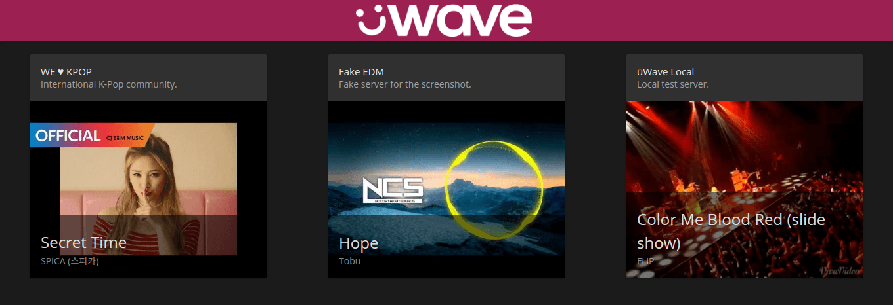

# üWave Server Hub

A web app indexing available public üWave servers.

[Live Site][] - [Adding Your Server](#adding-your-server) - [License](#license)

[][Live Site]

## Adding Your Server

Add the `u-wave-announce` plugin to your üWave server:

```js
import uwave from 'u-wave-core';
import announce from 'u-wave-announce';

const uw = uwave({ /* Options. */ });

uw.use(announce({
  name: 'Your server name',
  subtitle: 'Very short description', // Up to about 30 characters.
  description: `
    Longer description about your server, perhaps with a list of rules.
    May include _markdown_, even!
  `,
  url: 'https://my-uwave-server.com',
}));
```

For example, the [WE ♥ KPOP](https://welovekpop.club) server announces:

```js
uw.use(announce({
  name: 'WE ♥ KPOP',
  subtitle: 'International K-Pop community.',
  description: `
    WE ♥ KPOP is a Korean music dedicated community founded in 2014 on plug.dj.
    It was reborn in 2016 on its own collaborative listening software üWave.

    ## Rules

    1. Play only Korean related songs.
    2. Songs that are over 7:00 minutes long might be skipped.
    3. Songs that are heavily downvoted might be skipped.
    4. Songs that are in the history (previous 25 songs) will be skipped.
    5. Try to play the best quality versions of songs.
    6. Chat in English!
    7. Don't spam the chat.
  `,
  url: 'https://welovekpop.club/',
}));
```

## License

[MIT][]

[MIT]: ./LICENSE

[Live Site]: https://hub.u-wave.net
